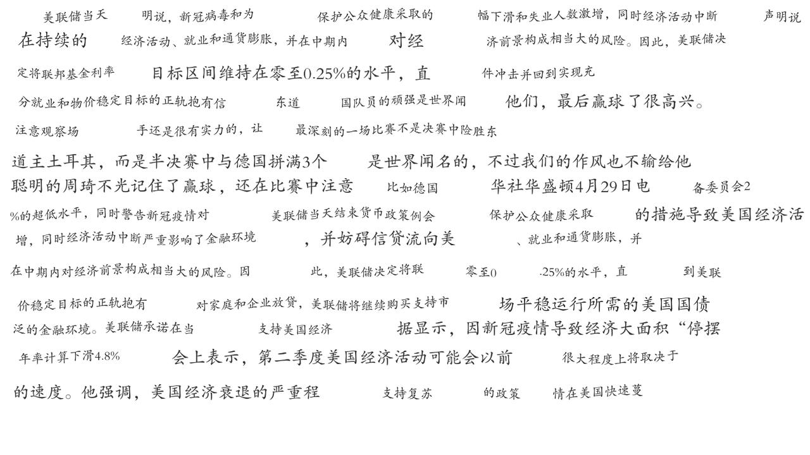
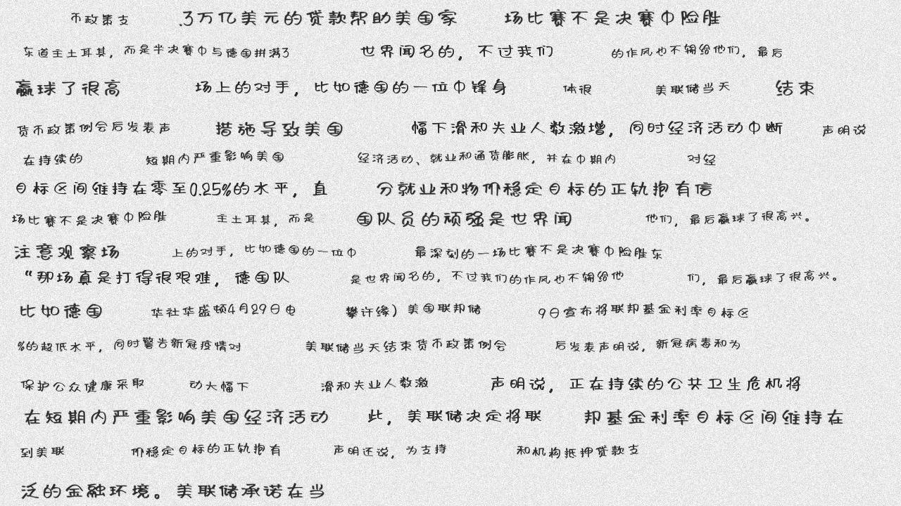
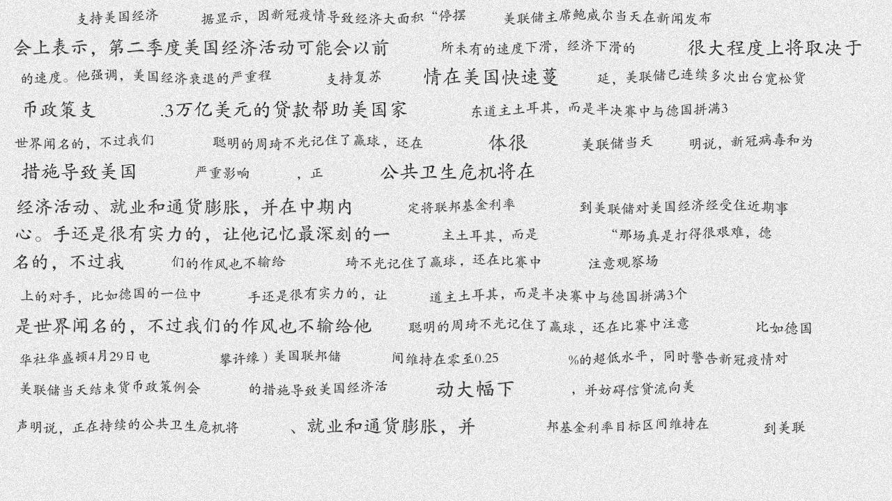

#   OCR 识别


通过生成各种字体的文本，自动生成中文手写体图片，并做了数据增强，用于文本区域检测算法训练。


## 建立环境

```shell script
conda create -n  ocr-cn python=3.6 pip scipy numpy ##运用conda 创建python环境
source activate ocr-cn
pip install -r requirements.txt -i https://mirrors.163.com/pypi/simple/
```

## 字符串切割

```
sh split_text/split_text.sh split_text/sample_data/test.txt   
```
可以根据实际需要 替换自己生成数据的文本内容


## 生成合成图片 

```shell script
python3 synth_image/run.py -c 3 --font_dir synth_image/fonts/cn -i dataset/text_split.txt -lc 50
python3 synth_image/run.py -c 20 --font synth_image/fonts/cn/仿宋_GB2312.ttf -i dataset/text_split_en.txt -lc 10 --output_dir ~/datasets/en_20


#  -c               生成数据的数量
#  --font_dir       字体文件夹
#  -lc              每张图片最多的字符串数量 
```

可以根据实际需要 选择字体文件


## 参考内容

* [icdar dataset](https://rrc.cvc.uab.es/?com=introduction)
* 文本生成图片  [TRDG 文本生成图片代码](https://github.com/Belval/TextRecognitionDataGenerator)
* 可以添加多种手写字体文件  [免费中文字体文件下载地址](http://www.sucaijishi.com/material/font/)
 
 
## 示例图片





